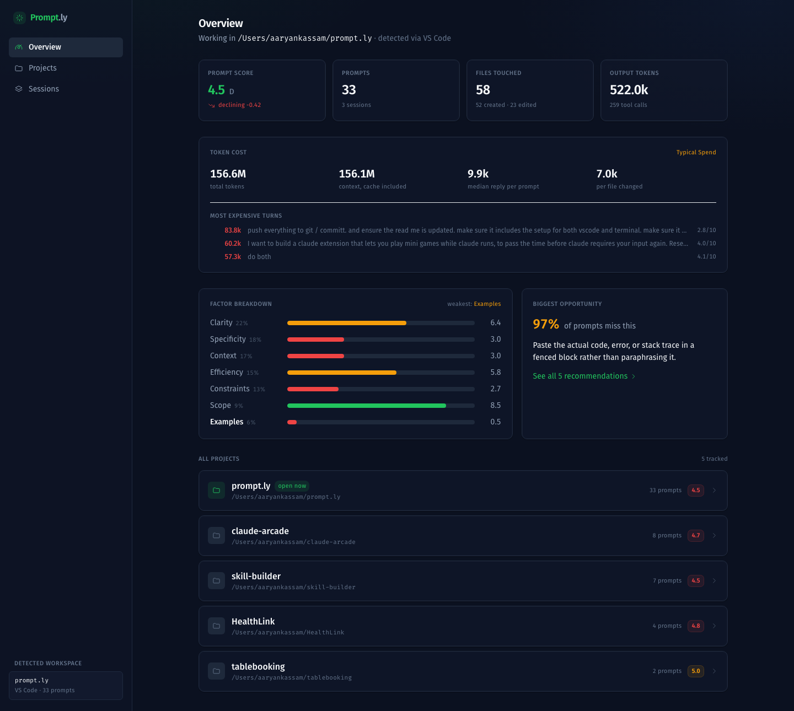
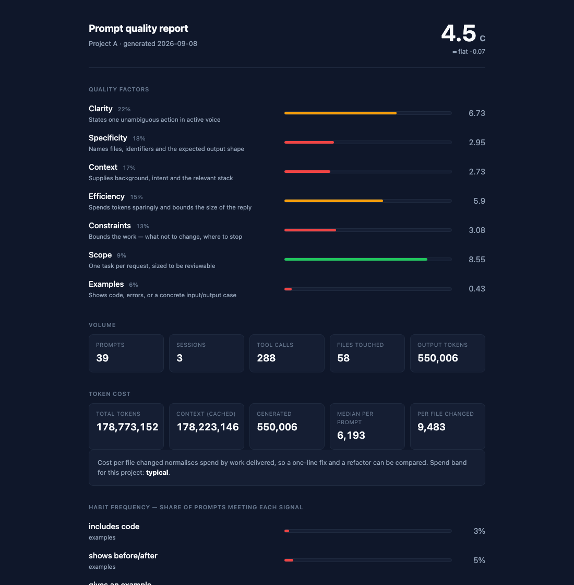

# prompt.ly

Scores how effectively you prompt Claude, per project — then shows you how to improve.

Prompt.ly reads the Claude Code session logs already on your machine, grades every prompt 0–10 across seven factors — six for quality, one for token efficiency — and reports how you're doing in whichever project you're working on. It runs entirely locally.



---

## Why

Everyone using an AI coding assistant is writing dozens of prompts a day, and nobody gets feedback on any of them. A vague prompt costs a search, a wrong guess, and a round trip — but that cost is invisible, so the habit never changes.

Prompt.ly makes it visible — in both directions. It found that 97% of my prompts never paste the actual error and 91% never name a file, and that a single two-word prompt (`"do both"`) cost 57,303 output tokens.

---

## Four ways to use it

All four read the same database and call the same scoring engine, so they can never disagree about what a prompt is worth.

| Surface | Best for |
|---|---|
| **Terminal** | Scoring a draft *before* you send it, with its projected token cost; cwd-aware reports |
| **VS Code** | A sidebar score for the project you're in, while you work |
| **Claude app** | Asking "how's my prompting?" in conversation |
| **Dashboard** | Deep dives, expandable factors, the playbook, sharing |

---

## Install

Requires Python 3.10+ and Claude Code. One line:

```bash
git clone https://github.com/AaryanKassam/Prompt.ly.git && cd Prompt.ly && ./setup
```

`./setup` creates the virtualenv, installs the five dependencies, puts `promptly` on your PATH, imports your existing Claude Code history, registers the auto-import hook, and installs the VS Code extension into every VS Code-family editor it finds — naming each one as it goes.

It is **safe to re-run**: every step checks before it acts, so it doubles as a repair command when something drifts.

```bash
./setup --no-path      # don't touch your shell rc file
./setup --no-hook      # skip the auto-import hook
./setup --no-vscode    # skip the editor extension
```

The only thing it changes outside the repo is one `export PATH` line in your `.zshrc`/`.bashrc`, and only if `~/.local/bin` isn't already on your PATH. It says so when it does.

### The three commands you'll actually use

```bash
promptly score "your draft prompt"   # rate + token cost BEFORE you send it
promptly report                      # how you're prompting in this folder
./scripts/dev                        # launch the dashboard at localhost:3000
```

Everything else is optional. `promptly doctor` re-checks every part of the setup.

Three optional extras, each needed for exactly one feature:

```bash
backend/venv/bin/pip install anthropic                     # prompt rewrites + playbook
backend/venv/bin/pip install "mcp[cli]"                    # Claude desktop extension
backend/venv/bin/pip install torch sentence-transformers   # training the MLP
```

<details>
<summary><b>Setting it up by hand instead</b></summary>

```bash
python3 -m venv backend/venv
backend/venv/bin/pip install -r backend/requirements.txt
ln -s "$PWD/scripts/promptly" ~/.local/bin/promptly    # put it on your PATH
promptly install-hook                                  # auto-import after each session
promptly sync                                          # import existing history
```

</details>

### Terminal

`install-hook` registers a Claude Code `SessionEnd` hook, so new sessions import themselves and there's nothing to remember to run. Run `promptly` on its own to see every command.

> **Using the VS Code integrated terminal?** Nothing extra to install. It is an ordinary interactive shell, so it reads the same `~/.zshrc` (or `~/.bashrc`) that `./setup` configured. Run the same `promptly` commands there as in Terminal.app — one install covers both. If `promptly` works in Terminal but not in VS Code, the integrated terminal is likely set to a non-interactive or different shell; the fix is to add `export PATH="$HOME/.local/bin:$PATH"` to the rc file that shell reads.

**Score a prompt before you send it** — the thing only the terminal can do:

```bash
promptly score "fix the parser"    # inline
promptly score -c                  # score whatever you just copied
promptly score -e                  # compose in $EDITOR
cat draft.txt | promptly score     # from a file
```

It prints the score, the factor breakdown, and a projected token cost:

```
╭──────────────────────── projected token cost ────────────────────────╮
│ 17 tokens to send  →  ~1,980 tokens back   (you capped the reply)    │
╰──────────────────────────────────────────────────────────────────────╯
```

The projection comes from the median output observed for prompts with the same efficiency signals. It is a guide, not a guarantee — a short prompt that kicks off a large refactor will sail straight past it.

Then the rest:

| Command | Short | What |
|---|---|---|
| `promptly report [path]` | `r` | Report for a folder, defaulting to the current one |
| `promptly projects` | `p` | Every tracked folder |
| `promptly watch` | `w` | Live report, refreshes as you work |
| `promptly share` | | Redacted report safe to send to someone else |
| `promptly doctor` | `check` | Check the setup and print the fix for anything broken |
| `promptly sync` | | Import new sessions now |
| `promptly validate` | | Measure the scorer against the benchmark |
| `promptly workspaces` | | Folders currently open in VS Code / Cursor |
| `promptly reclassify` | | Re-label and rescore after an upgrade |

`promptly help` prints all of these grouped by when you'd reach for them, and `--json` works on most of them for scripting.

The launcher re-execs under the repo venv, so it works from any directory regardless of which Python is active.

### VS Code

Already installed by `./setup` — just reload the window (`Cmd+Shift+P` → *Developer: Reload Window*) and the Prompt.ly icon appears in the activity bar. To link it by hand:

```bash
ln -s "$PWD/vscode-extension" ~/.vscode/extensions/promptly-1.0.0
```

- **Sidebar** — score, trend, factor bars, token cost, recommendations, worst prompts for the folder you have open
- **Status bar** — this project's score, always visible
- **Right-click any selection** → *Prompt.ly: Score selected text as a prompt*
- Multi-root aware: re-targets when you switch between projects

It holds no scoring logic — it shells out to `promptly report --json`. If the CLI isn't found automatically, set `promptly.cliPath` in settings to the absolute path of `scripts/promptly`.

### Dashboard

```bash
./scripts/dev            # starts both servers
```

Open **http://localhost:3000**. `./scripts/dev stop` shuts them down.

### Claude app extension

```bash
backend/venv/bin/python mcp_server/install.py
```

Restart the Claude desktop app, then ask *"what's my prompt report?"*. It auto-detects the folder open in your editor. Five tools: `prompt_report`, `score_draft_prompt`, `detect_workspace`, `list_tracked_projects`, `refresh_data`.

### Chrome extension (optional)

Only needed to capture claude.ai — Claude Code is covered by the log parser. See [`extension/README.md`](extension/README.md).

---

## How scoring works

Every prompt is graded 0–10 across seven weighted factors, built from 23 structural signals:

| Factor | Weight | Measures |
|---|---|---|
| Clarity | 22% | One unambiguous action, active voice, no hedging |
| Specificity | 18% | Names files, identifiers, expected output shape |
| Context | 17% | Background, intent, relevant stack |
| **Efficiency** | **15%** | **Tokens spent, and whether the reply size is bounded** |
| Constraints | 13% | What not to change, where to stop |
| Scope | 9% | One task per request, sized to be reviewable |
| Examples | 6% | Code, errors, or a concrete input/output case |

**The scorer is deterministic and runs offline.** No language model is involved in producing a score — that's the point. A rubric you own is defensible; a wrapper around someone else's judgement isn't.

### Token efficiency

Prompt quality and prompt *cost* are different axes, and the second one is where the money goes. `"do both"` scores 4.1/10 and is two words long — and it drew **57,303 output tokens**. Being terse is not the same as being efficient.

So Prompt.ly measures both:

**The `efficiency` factor** predicts cost from the text alone, which is what makes it usable *before* you send:

| Signal | Evidence |
|---|---|
| `concise_prompt` (≤60 words) | **p = 0.010** — median 3.3k vs 14.1k output tokens |
| `no_filler_phrases` | p = 0.094 — median 3.7k vs 13.9k |
| `bounds_response_size` | underpowered (only 5 prompts in the corpus bound their reply) |
| `no_redundant_restatement` | not separated on this corpus |

Measured by Mann–Whitney U on 45 real turns. Only the first is significant at p < 0.05; the other two are kept because each directly causes tokens to be spent, but they are **not yet demonstrated**, and the 15% weight is set to reflect that rather than to overstate it. Retune with `PROMPTLY_EFFICIENCY_WEIGHT=0.25` — the other six factors rescale to keep the weights summing to 1.

**Measured token economics** is the other half — what your prompting actually cost, from the transcript:

```
token cost
      total tokens  156,630,884
  context / output  156,108,884 · 522,000
 median per prompt  9,893 out  (typical)
  per file changed  6,960 out
```

Two things worth knowing about these numbers:

- **Context includes cache.** Claude Code caches aggressively, so the raw `input_tokens` field has a median of *2*. Reading it alone understates a project's context cost by four orders of magnitude — this repo's real figure is ~156M, not the 20k a naive reading gives. Prompt.ly sums `input + cache_read + cache_creation`.
- **Cost per file changed is the honest metric.** Raw totals punish a big task for being big. Normalising by work delivered is what makes a one-line fix and a refactor comparable.

Neither number is causal. A prompt that costs 60k tokens may have been doing 60k tokens of legitimate work; these are observational figures on one corpus, and they are labelled that way in the code.

### Does it actually work?

`promptly validate` measures it against a benchmark of 20 hand-written pairs, each expressing the same request once weakly and once well. Pairing controls for topic, so the result reflects prompt quality rather than subject matter.

| Metric | Result |
|---|---|
| Weak mean | 4.17 / 10 |
| Strong mean | 6.45 / 10 |
| **Pairwise accuracy** | **20 / 20** |
| **AUC** | **0.981** |

Those four figures come from a fixed fixture, so they are reproducible: `promptly validate` gives the same answer on your machine as on mine.

It also correlates scores against independent outcome signals (repetition, iteration count, clarification requests, diff alignment) on real prompts — so the rubric isn't grading its own homework. On this machine's 55 scored prompts that correlation is **r = 0.165**.

That number is low, and worth stating plainly rather than burying: the benchmark separates hand-written good and bad prompts almost perfectly, but predicting real-world outcomes from prompt text alone is a much harder problem, and 55 prompts is a small sample. Adding the efficiency factor moved it from **0.103 to 0.165** on the same corpus — a real improvement, on a metric that still has a long way to go.

Against token cost specifically, the efficiency factor correlates **r = −0.211** with output tokens: higher efficiency, fewer tokens burned, in the direction it was designed to predict.

> Every figure in this section that comes from *real prompts* — the correlations, the token totals above — is a snapshot of one machine's corpus on 2026-08-31 and moves as that corpus grows. The benchmark table does not. Run `promptly validate` and `promptly report` for your own numbers.

---

## Where a language model *is* used

Two optional features, both garnish over numbers measured locally first:

- **Rewrite this prompt** — a full rewrite of one weak prompt
- **Playbook** — turns your measured weaknesses into a personalised guide with your own prompts rewritten

Both need an API key. Everything else works without one.

```bash
cp .env.example .env      # then paste your key into ANTHROPIC_API_KEY
./scripts/dev             # restart to pick it up
```

Rewrites return an **assumptions list** naming anything the model invented — a file path, a rationale — so it's never presented as fact you can rely on.

---

## Sharing a report

The dashboard shows your prompt text, file paths and session titles. None of that can go to an employer.

```bash
promptly share              # ./promptly-report-<project>.html
promptly share --anonymize  # ...with the folder name hidden
```



The file carries aggregate scores, factor breakdowns, all 23 habit rates, aggregate token cost, activity counts and the benchmark result. It contains **no prompt text, no file paths, no session titles**. Redaction is a whitelist, so a field added to the internal report later cannot leak into a shared file by default.

---

## Privacy

Everything runs on your machine. There is no server, no account, and no telemetry.

- Prompt data comes from `~/.claude/projects/`, which Claude Code already writes
- The database is a local SQLite file at the repo root
- The Chrome extension talks only to `localhost`, and text capture is off until you turn it on
- The only outbound network call is to the Anthropic API, only for the two optional features above, and only if you configure a key

---

## Architecture

```
prompt.ly/
├── setup                 One-command installer (safe to re-run)
├── backend/              FastAPI + SQLAlchemy
│   ├── cli.py            The `promptly` terminal UI
│   ├── reports.py        Per-project report engine, cache, token economics
│   ├── improve.py        Offline rewrite of a weak prompt
│   ├── share.py          Redacted shareable report
│   ├── validation.py     Benchmark + outcome correlation
│   ├── workspace.py      Detects the folder open in VS Code / Cursor
│   ├── llm.py            The only language-model calls in the project
│   ├── ingestion/        JSONL parser, classifier, attribution
│   └── ml/               23 signals, rubric, MLP, trainer
├── frontend/             Next.js 14 + Tailwind dashboard
├── vscode-extension/     Sidebar, status bar, score-selection
├── mcp_server/           Claude desktop extension (5 tools)
├── extension/            Chrome extension for claude.ai
└── scripts/              promptly launcher, dev servers, importers
```

Two details worth knowing:

**Transcript noise is excluded.** Half of the recorded "user turns" were never typed by a person. In this repo's 108 rows: 33 system notices, 10 skill injections, 10 slash-command echoes and 1 empty turn, against 54 real prompts. They're long and well-structured, so they scored *highly* and crowded out genuine prompts in the rankings. `ingestion/classify.py` filters them.

**Prompts are attributed by the files they touched**, not the directory Claude Code launched in — otherwise work on one repo counts towards another.

---

## Troubleshooting

```bash
promptly doctor    # what's wired up, and the exact fix for anything that isn't
./setup            # re-run to repair a broken install; every step is idempotent
```

`doctor` checks logs, database, `.env`, API key, scoring model, auto-sync hook and both extensions. `./setup` rebuilds whatever is missing without touching what already works.

---

## License

MIT
